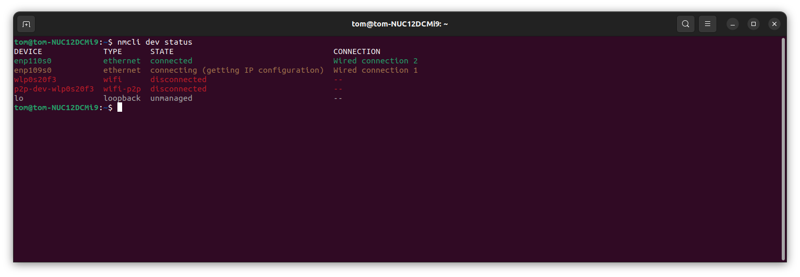
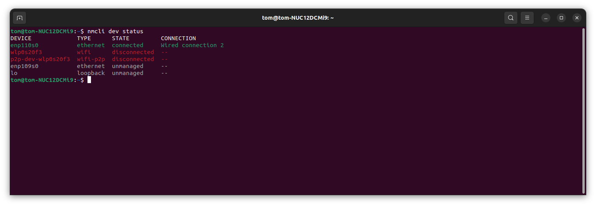

# Network configuration for the USRP
Connecting a USRP over Ethernet is rather easy, however,
due to the [UHD Documentation](https://files.ettus.com/manual/)
being all over the place and being rather sparse, it can 
be a royal pain to get the network configured properly. 
This page will describe how to set up and configure the 
network for USRP SDRs.

## Direct GbE Connection
Before you begin, make sure your USRP is connected to your
computer and powered on (this should be an obvious step).

After turning on the USRP, run the following command to
figure out which device your USRP is connected to.

``` {bash}
nmcli dev status
```

This should tell you the current status of all the
networking devices. There should be one device that says
"connecting." In the image below, the device is "enp109s0."



Once you identify the device the USRP is connected to,
you need to tell the network manager to no longer manage
that device by running the following command.

``` {bash}
nmcli dev set <interface> managed no
```

The status should now look something like this.



After telling the network manager not to manage that device,
you want to add a static IP address to interact with. Run
the following command.

``` {bash}
sudo ip addr add 192.168.10.1/24 dev <interface>
```

Once the IP address is configured, the socket buffers and the
interface MTU should also be updated. Run the following commands.

``` {bash}
sudo sysctl -w net.core.rmem_max=33554432
sudo sysctl -w net.core.wmem_max=33554432
sudo ifconfig <interface> mtu 1500
```
